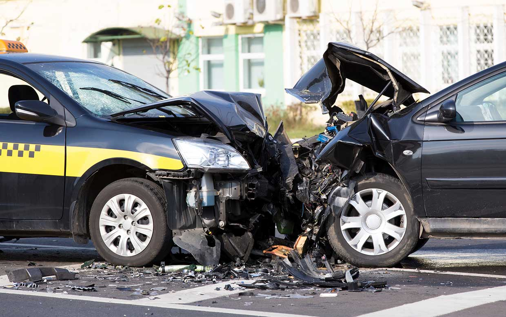

# Optimize Collision detection

Comparing improvement in collision detection of agents using quad trees over brute force method.

Check out the corresponding medium blog post [Collision detection using quad-tree data structure](https://medium.com/@abhinav.sagar/collision-detection-using-quad-tree-data-structure-ff7f6e8b819).

## To execute
Just open project.html file in web browser.
